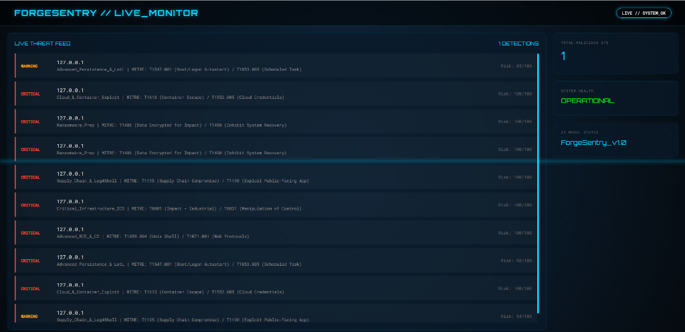
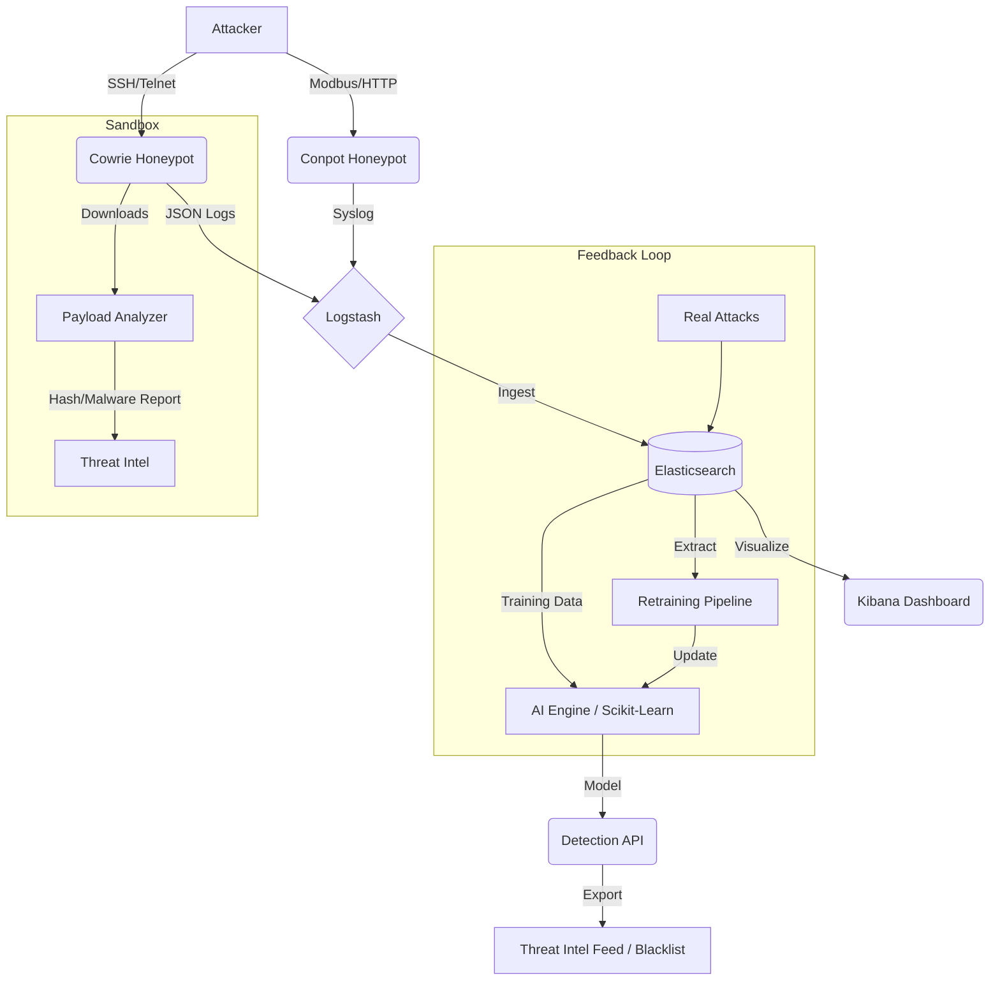

# 🛡️ ForgeSentry: AI-Powered IoT Threat Intelligence System


**ForgeSentry** is an autonomous cybersecurity ecosystem that deploys high-interaction honeypots to capture real-time attacks, aggregates logs via the ELK stack, and utilizes a **Random Forest Machine Learning model** to classify attack vectors (e.g., Mirai Botnet, Brute Force, RCE) instantly.

## 🖼️ Visual Evidence (Titan V3 Engine)



*ForgeSentry Live SOC Command Center demonstrating real-time MITRE ATT&CK mapping and Risk Scoring.*

---

## 🚀 Key Features

*   **🍯 Managed Decoy Infrastructure**:
    *   **Cowrie & Conpot Deployment**: High-interaction deception environment simulating critical IoT/ICS infrastructure (Modbus, S7, SSH).
*   **🧠 Heuristic Cognitive Engine**:
    *   **Advanced ML Classification**: Uses TF-IDF Vectorization & Random Forest Classifiers for zero-day threat detection.
    *   **Behavioral Risk Scoring**: Dynamically calculates threat severity (0-100) based on command entropy and intent.
    *   **Adaptive Evolution**: Continuous learning loop that allows the model to ingest real-time attack data and retrain itself, ensuring immunity to emerging 0-day variants.
*   **⚡ Enterprise-Grade Intel API**:
    *   **MITRE ATT&CK® Mapping**: Automatic TTP identification (e.g., T1059.004) for every detected intrusion.
    *   **RESTful Intelligence Feeds**: Real-time STIX 2.1 and JSON blacklist distribution for SIEM/Firewall synchronization.
*   **📊 Visualization & Ops**:
    *   **SOC Command Center**: Custom cyberpunk-inspired live monitor for real-time situational awareness.
    *   **ELK Stack Integration**: Global attack heatmap and temporal trend analysis via Elasticsearch & Kibana.

## 🏗️ Architecture



## 🛠️ Installation & Deployment

### Prerequisites
*   Docker & Docker Compose
*   Python 3.9+
*   1x VPS (AWS Lightsail, DigitalOcean, etc.) - **Do NOT run locally.**

### 1. Deploy Infrastructure
```bash
git clone https://github.com/yourusername/ForgeSentry.git
cd ForgeSentry/deployment
chmod +x setup.sh
./setup.sh
```

### 2. Train the AI Model (The Feedback Loop)
You can train on synthetic data OR real-world logs captured by your honeypot.

**Option A: Virtual Training (Synthetic)**
```bash
cd ../ai_engine
python generate_dummy_data.py
python train_model.py --input ../data_processing/training_data.csv
```

**Option B: Real-World Feedback Loop**
Once your honeypot has been running and attracting hackers:
```bash
python retrain_pipeline.py
```
*This extracts real logs from Elasticsearch and retrains the model to adapt to new threats.*

**Option C: Custom Data Injection**
Inject your own threat intelligence or specific 0-day samples for immediate protection:
1. Append samples to `data_processing/training_data.csv`.
2. Execute `python train_model.py --input ../data_processing/training_data.csv`.
3. The TITAN engine will instantaneously update its behavioral signatures.

### 3. Threat Intelligence & Sandbox
**Payload Analysis**:
Scan captured malware files dropped by bots:
```bash
python ../threat_intel/payload_analyzer.py
```

**Export Threat Feed**:
The API serves live intelligence feeds of detected malicious IPs:
- **JSON Blacklist**: `GET /feed/blacklist`
- **STIX 2.1 (Interop)**: `GET /feed/stix` (Professional format for SIEM/Firewall integration)

---

## 🏛️ Powered by Intel Forge
ForgeSentry is built in collaboration with **Intel Forge**, focusing on "Data Beyond History." It implements advanced security standards to ensure that captured threat data is actionable and interoperable across the global cybersecurity ecosystem.


### 4. Start Detection Service
```bash
cd ..
uvicorn detection.detection_api:app --reload
```

### 🌍 View Web Interfaces
- **Main Portal**: Open `index.html` in your browser.
- **Live Monitor**: Open `dashboard/monitor.html` in your browser.

## 📊 Dashboard
Access Kibana at `http://<your-vps-ip>:5601` to view your Threat Map.

## 🤝 Contributing
Pull requests are welcome. For major changes, please open an issue first to discuss what you would like to change.

## 👨‍💻 Author

**Muhammad Hamza Iqbal** - [Connect on LinkedIn](https://www.linkedin.com/in/muhammad-hamza-iqbal-0b4413293/) / [GitHub](https://github.com/MalikHamza7)
**Intel Forge** — [*“Data Beyond History”*](https://intelforge.org)

## 📜 License
[MIT](https://choosealicense.com/licenses/mit/)
